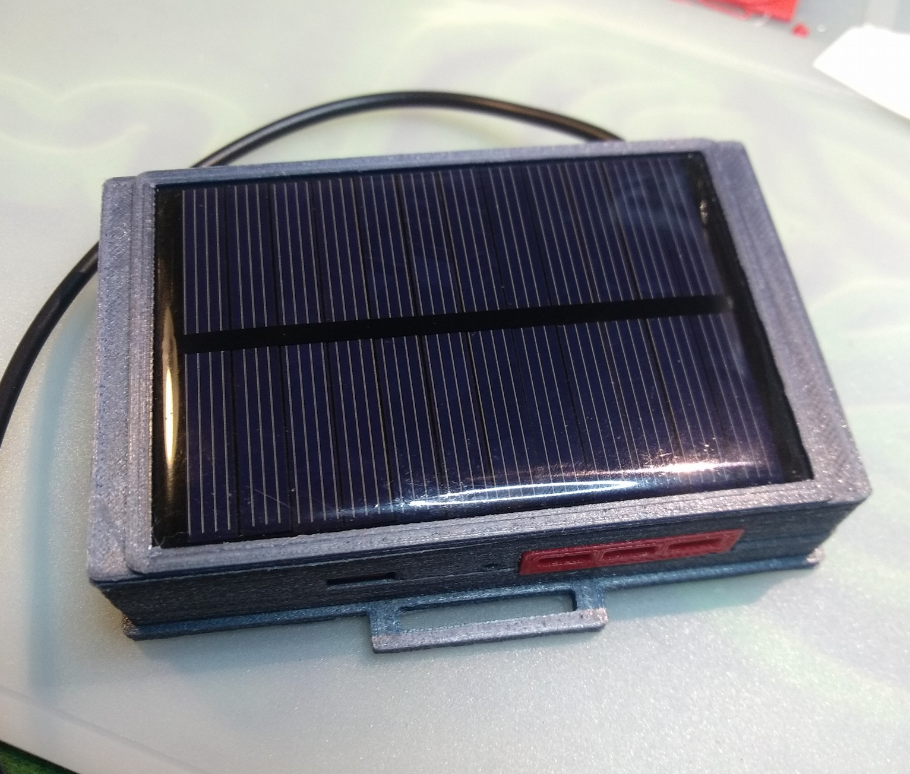
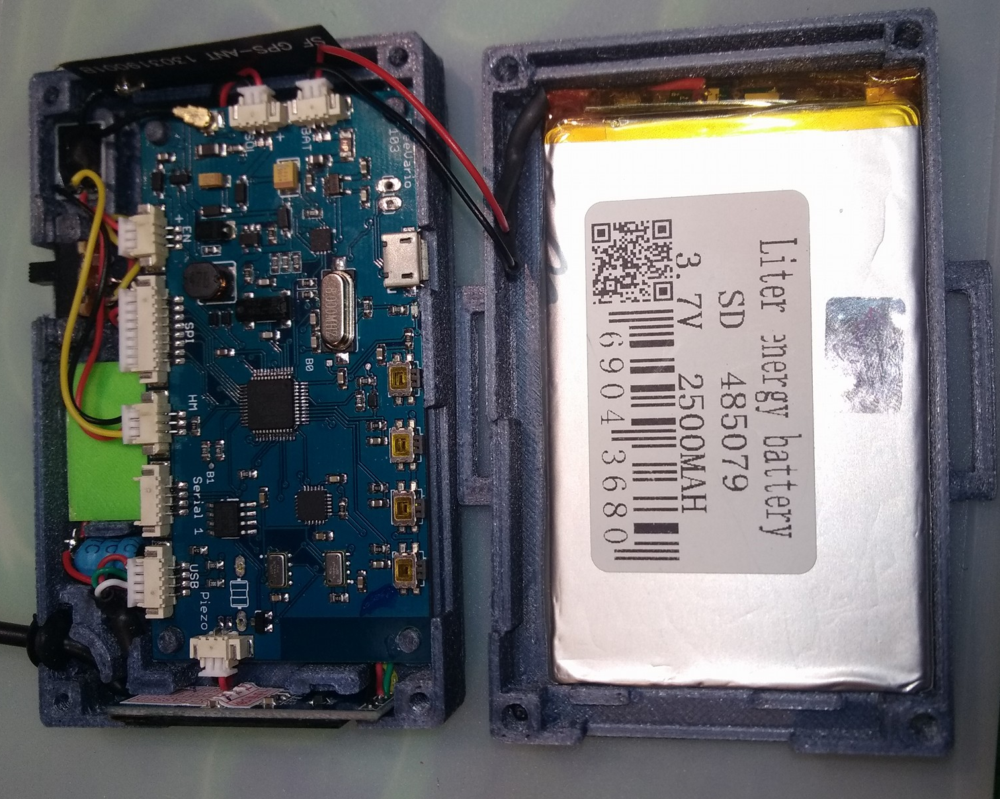

## Welcome to FreeVario

Freevario is an opensource device to provides telemetry data to any vario based program such as XCSoar or XCTrack via bluetooth or wifi. It is based on de STM32F3 processor. The project includes the board Eagle design and source code.

  
  

### Features:

Bluetooth, Serial or USB OTG streaming 
Solar charger  
Power bank (200mA)  
Dual pressure sensor support  
Adaptive Vario*  
Humidity sensor  
Accelerometer 
Piezo speaker for vario audio  
Serial GPS NMEA  
NMEA Output PCProbe, PTAS1 and LXNAV 

*Adaptive Vario: The sensitivity filter of the barometric sensors are adapted according to the environment. Eg. On a quiet day your flight will be more stable, causing the filter to become more sensitive to changes, this way you will be able to detect the lighter thermals.

